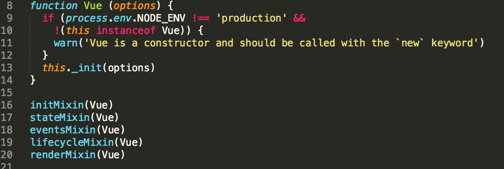
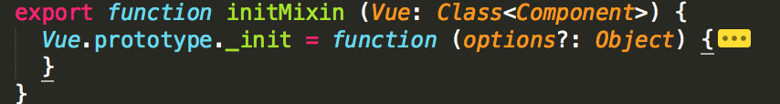
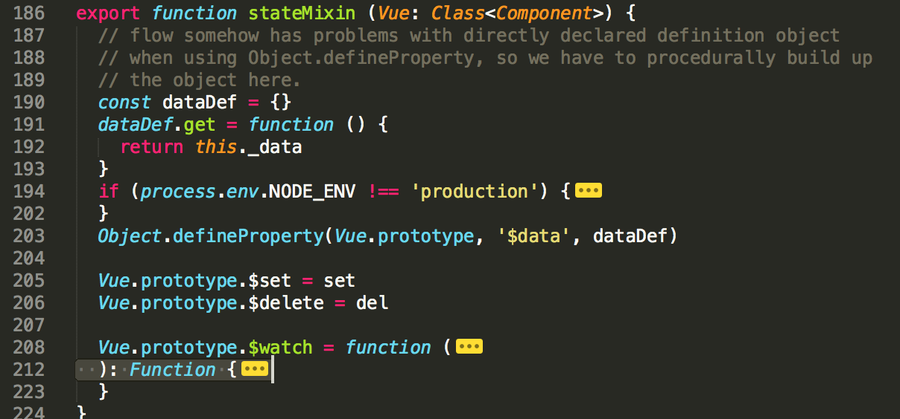
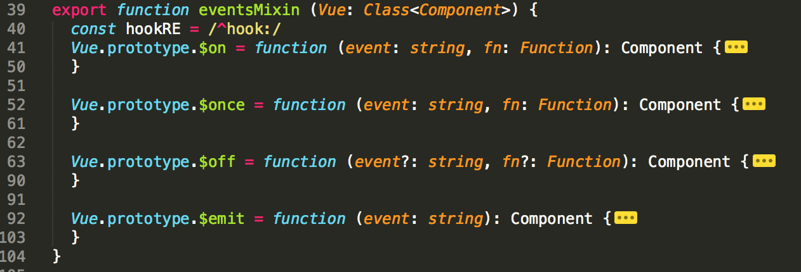
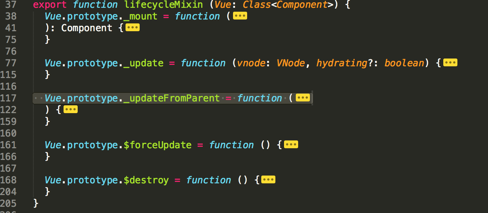
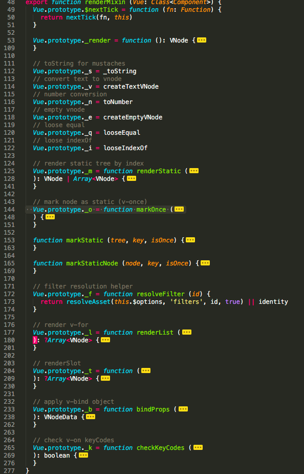
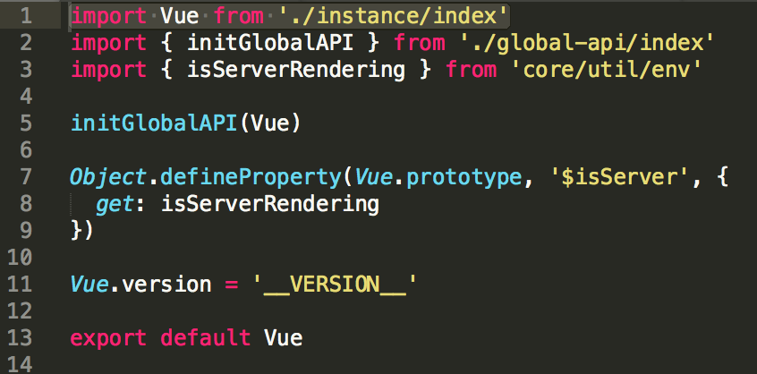
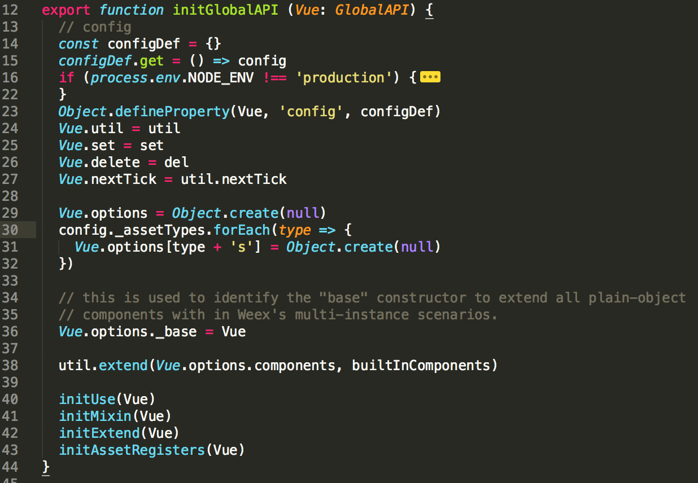
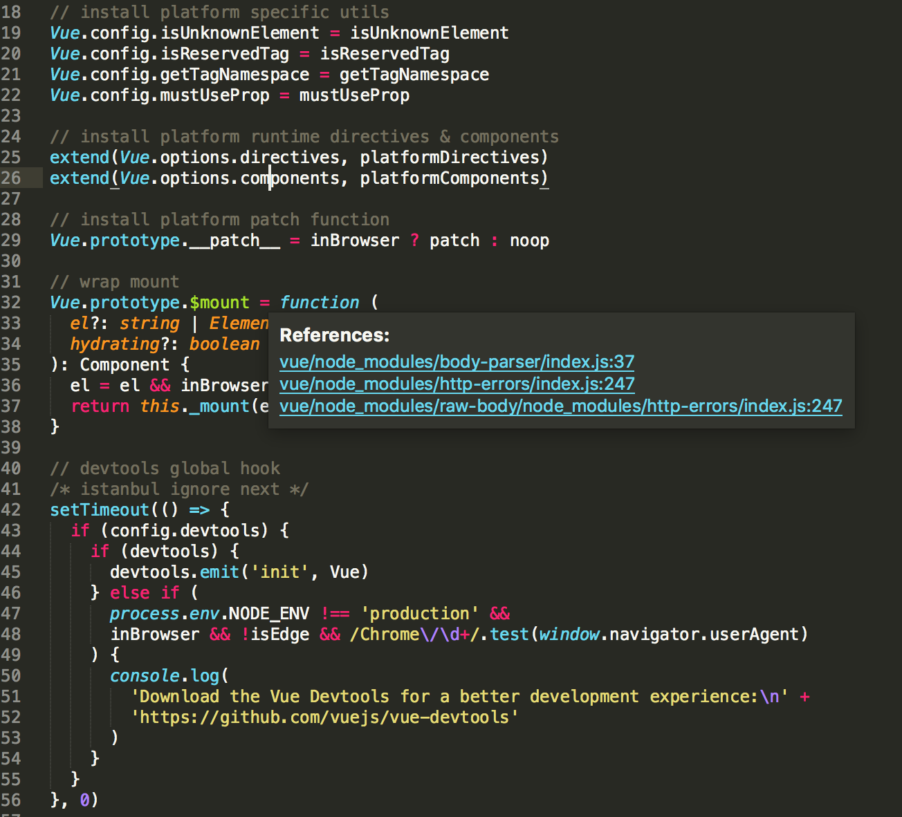

## Vue构造器追踪

### 首先我们来看 

`npm run dev` 这条指令会生成vue.js

在package.json中我们可以看到
>"dev": "TARGET=web-full-dev rollup -w -c build/config.js"

找到`config.js`我们可以看到

	  'web-full-dev': {
	    entry: path.resolve(__dirname, '../src/entries/web-runtime-with-compiler.js'),
	    dest: path.resolve(__dirname, '../dist/vue.js'),
	    format: 'umd',
	    env: 'development',
	    alias: { he: './entity-decoder' },
	    banner
	  },

此处可以看到入口文件和出口文件

	entry: path.resolve(__dirname, '../src/entries/web-runtime-with-compiler.js'),
    dest: path.resolve(__dirname, '../dist/vue.js'),
    
 
然后我们就从这个文件一直追寻vue的构造函数

首先我们进入`web-runtime-with-compiler.js`可以看到
>import Vue from './web-runtime'

一直跳转下去会看到
>import Vue from 'core/index'

>import Vue from './instance/index'

直到此时你会看到`Vue`的构造函数

然后以vue的构造函数为参数调用了五个方法

经过这五个方法后我们看总结下Vue.prototype上的挂载的方法或属性

	> initMixin(Vue)	src/core/instance/init.js 
	**************************************************
	Vue.prototype._init = function (options?: Object) {}
	
	> stateMixin(Vue)	src/core/instance/state.js 
	**************************************************
	Vue.prototype.$data
	Vue.prototype.$set = set
	Vue.prototype.$delete = del
	Vue.prototype.$watch = function(){}
	
	> eventsMixin(Vue)	src/core/instance/events.js 
	**************************************************
	Vue.prototype.$on = function (event: string, fn: Function): Component {}
	Vue.prototype.$once = function (event: string, fn: Function): Component {}
	Vue.prototype.$off = function (event?: string, fn?: Function): Component {}
	Vue.prototype.$emit = function (event: string): Component {}
	
	> lifecycleMixin(Vue)	src/core/instance/lifecycle.js 
	**************************************************
	Vue.prototype._mount = function(){}
	Vue.prototype._update = function (vnode: VNode, hydrating?: boolean) {}
	Vue.prototype._updateFromParent = function(){}
	Vue.prototype.$forceUpdate = function () {}
	Vue.prototype.$destroy = function () {}
	
	> renderMixin(Vue)	src/core/instance/render.js 
	**************************************************
	Vue.prototype.$nextTick = function (fn: Function) {}
	Vue.prototype._render = function (): VNode {}
	Vue.prototype._s = _toString
	Vue.prototype._v = createTextVNode
	Vue.prototype._n = toNumber
	Vue.prototype._e = createEmptyVNode
	Vue.prototype._q = looseEqual
	Vue.prototype._i = looseIndexOf
	Vue.prototype._m = function(){}
	Vue.prototype._o = function(){}
	Vue.prototype._f = function resolveFilter (id) {}
	Vue.prototype._l = function(){}
	Vue.prototype._t = function(){}
	Vue.prototype._b = function(){}
	Vue.prototype._k = function(){}

### 这些方法你可以看一眼留个印象后文会用到

>到目前为止只是最开始我们找到的最后一个文件对Vue的处理都是在原型上挂的一超级方法和属性下边我们一个文件一个文件往前看

> 从instance/index导出Vue后进入找到`'core/index'`

>此文件主要导入 initGlobalAPI 和 isServerRendering，之后将Vue作为参数传给 initGlobalAPI ，最后又在 Vue.prototype 上挂载了 $isServer ，在 Vue 上挂载了 version 属性。
>我们看下initGlobalAPI做了什么处理

>经过这个文件处理后

	// src/core/index.js / src/core/global-api/index.js
	Vue.config
	Vue.util = util
	Vue.set = set
	Vue.delete = del
	Vue.nextTick = util.nextTick
	Vue.options = {
	    components: {
	        KeepAlive
	    },
	    directives: {},
	    filters: {},
	    _base: Vue
	}
	Vue.use
	Vue.mixin
	Vue.cid = 0
	Vue.extend
	Vue.component = function(){}
	Vue.directive = function(){}
	Vue.filter = function(){}
	
	Vue.prototype.$isServer
	Vue.version = '__VERSION__'

>下一个文件是web-runtime.js

### 主要做了三件事

>1、覆盖 Vue.config 的属性，将其设置为平台特有的一些方法

>2、Vue.options.directives 和 Vue.options.components 安装平台特有的指令和组件

>3、在 Vue.prototype 上定义 __patch__ 和 $mount

	// 安装平台特定的utils
	Vue.config.isUnknownElement = isUnknownElement
	Vue.config.isReservedTag = isReservedTag
	Vue.config.getTagNamespace = getTagNamespace
	Vue.config.mustUseProp = mustUseProp
	// 安装平台特定的 指令 和 组件
	Vue.options = {
	    components: {
	        KeepAlive,
	        Transition,
	        TransitionGroup
	    },
	    directives: {
	        model,
	        show
	    },
	    filters: {},
	    _base: Vue
	}
	Vue.prototype.__patch__
	Vue.prototype.$mount

>最后一个文件

### 主要两件事

> 1、缓存来自 web-runtime.js 文件的 $mount 函数

> 2、在 Vue 上挂载 compile

### 至此，我们还原了Vue构造函数

	1、Vue.prototype 下的属性和方法的挂载主要是在 src/core/instance 目录中的代码处理的

	2、Vue 下的静态属性和方法的挂载主要是在 src/core/global-api 目录下的代码处理的
	
	3、web-runtime.js 主要是添加web平台特有的配置、组件和指令，web-runtime-with-compiler.js 给Vue的 $mount 方法添加 compiler 编译器，支持 template。