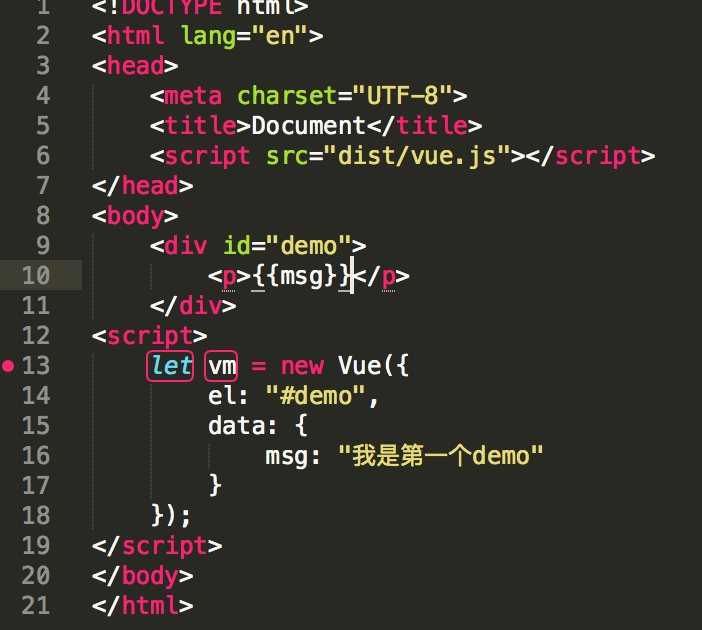

## Vue实例初始化过程

## 下面我们能过一个小demo来看下Vue都干了什么

>我们来看下发生了什么

	function Vue (options) {
	  if (process.env.NODE_ENV !== 'production' &&
	    !(this instanceof Vue)) {
	    warn('Vue is a constructor and should be called with the `new` keyword')
	  }
	  this._init(options)
	}

>_init就是Vuew调用的第一个方法(src/core/instance/init.js

>分析下就可以知道执行了下列方法

	vm.$options = mergeOptions(
      resolveConstructorOptions(vm.constructor),
      options || {},
      vm
    )
    vm._self = vm
    initLifecycle(vm)
    initEvents(vm)
    callHook(vm, 'beforeCreate')
    initState(vm)
    callHook(vm, 'created')
    initRender(vm)

>mergeOptions 
	
	vm.constructor其实就是Vue

>resolveConstructorOptions

	function resolveConstructorOptions (Ctor: Class<Component>) {
	  let options = Ctor.options
	  // 其实就是Vue.options
	  // 前面已经总结过
	  // Vue.options = {
		//     components: {
		//         KeepAlive,
		//         Transition,
		//         TransitionGroup
		//     },
		//     directives: {
		//         model,
		//         show
		//     },
		//     filters: {},
		//     _base: Vue
		// }

	  if (Ctor.super) {
	    const superOptions = Ctor.super.options
	    const cachedSuperOptions = Ctor.superOptions
	    const extendOptions = Ctor.extendOptions
	    if (superOptions !== cachedSuperOptions) {
	      // super option changed
	      Ctor.superOptions = superOptions
	      extendOptions.render = options.render
	      extendOptions.staticRenderFns = options.staticRenderFns
	      extendOptions._scopeId = options._scopeId
	      options = Ctor.options = mergeOptions(superOptions, extendOptions)
	      if (options.name) {
	        options.components[options.name] = Ctor
	      }
	    }
	  }
	  return options
	}
	
>了解了这些后我们来看下mergeOptions(src/core/util/options.js)

	// 1、引用依赖
	import Vue from '../instance/index'
	其他引用...
	
	// 2、合并父子选项值为最终值的策略对象，此时 strats 是一个空对象，因为 config.optionMergeStrategies = Object.create(null)
	const strats = config.optionMergeStrategies
	// 3、在 strats 对象上定义与参数选项名称相同的方法
	strats.el = 
	strats.propsData = function (parent, child, vm, key){}
	strats.data = function (parentVal, childVal, vm)
	
	config._lifecycleHooks.forEach(hook => {
	  strats[hook] = mergeHook
	})
	
	config._assetTypes.forEach(function (type) {
	  strats[type + 's'] = mergeAssets
	})
	
	strats.watch = function (parentVal, childVal)
	
	strats.props =
	strats.methods =
	strats.computed = function (parentVal: ?Object, childVal: ?Object)
	// 默认的合并策略，如果有 `childVal` 则返回 `childVal` 没有则返回 `parentVal`
	const defaultStrat = function (parentVal: any, childVal: any): any {
	  return childVal === undefined
	    ? parentVal
	    : childVal
	}
	
	// 4、mergeOptions 中根据参数选项调用同名的策略方法进行合并处理
	export function mergeOptions (
	  parent: Object,
	  child: Object,
	  vm?: Component
	): Object {
	
	  // 其他代码
	  ...
	
	  const options = {}
	  let key
	  for (key in parent) {
	    mergeField(key)
	  }
	  for (key in child) {
	    if (!hasOwn(parent, key)) {
	      mergeField(key)
	    }
	  }
	  function mergeField (key) {
	    const strat = strats[key] || defaultStrat
	    options[key] = strat(parent[key], child[key], vm, key)
	  }
	  return options
	}
	

>其实就是合并策略函数，之后第二部事件：初始化工作与Vue实例对象的设计
>前面讲了 Vue 构造函数的设计，并且整理了 Vue原型属性与方法 和 Vue静态属性与方法，而 Vue 实例对象就是通过构造函数创造出来的，让我们来看一看 Vue 实例对象是如何设计的，下面的代码是 _init()方法合并完选项之后的代码：

	/* istanbul ignore else */
	   if (process.env.NODE_ENV !== 'production') {
	     initProxy(vm)
	   } else {
	     vm._renderProxy = vm
	   }
	
	   // expose real self
		vm._self = vm
	   initLifecycle(vm)
	   initEvents(vm)
	   callHook(vm, 'beforeCreate')
	   initState(vm)
	   callHook(vm, 'created')
	   initRender(vm)

>根据上面的代码，在生产环境下会为实例添加两个属性，并且属性值都为实例本身：
>然后，调用了四个 init* 方法分别为：initLifecycle、initEvents、initState、initRender，且在 initState 前后分别回调了生命周期钩子 beforeCreate 和 created，而 initRender 是在 created 钩子执行之后执行的，看到这里，也就明白了为什么 created 的时候不能操作DOM了。因为这个时候还没有渲染真正的DOM元素到文档中。created 仅仅代表数据状态的初始化完成。

>下边是对四个init方法进行了总结

	// 在 Vue.prototype._init 中添加的属性 
	**********************************************************
	this._uid = uid++
	this._isVue = true
	this.$options = {
	    components,
	    directives,
	    filters,
	    _base,
	    el,
	    data: mergedInstanceDataFn()
	}
	this._renderProxy = this
	this._self = this
	
	// 在 initLifecycle 中添加的属性		
	**********************************************************
	this.$parent = parent
	this.$root = parent ? parent.$root : this
	 
	this.$children = []
	this.$refs = {}
	
	this._watcher = null
	this._inactive = false
	this._isMounted = false
	this._isDestroyed = false
	this._isBeingDestroyed = false
	
	// 在 initEvents	 中添加的属性	 	
	**********************************************************
	this._events = {}
	this._updateListeners = function(){}
	
	// 在 initState 中添加的属性		
	**********************************************************
	this._watchers = []
	    // initData
	    this._data
	
	// 在 initRender	 中添加的属性 	
	**********************************************************
	this.$vnode = null // the placeholder node in parent tree
	this._vnode = null // the root of the child tree
	this._staticTrees = null
	this.$slots
	this.$scopedSlots
	this._c
	this.$createElement

>以上就是一个Vue实例所包含的属性和方法，除此之外要注意的是，在 initEvents 中除了添加属性之外，如果有 vm.$options._parentListeners 还要调用 vm._updateListeners() 方法，在 initState 中又调用了一些其他init方法，如下：

	function initState (vm: Component) {
	  vm._watchers = []
	  initProps(vm)
	  initMethods(vm)
	  initData(vm)
	  initComputed(vm)
	  initWatch(vm)
	}
>最后在 initRender 中如果有 vm.$options.el 还要调用 vm.$mount(vm.$options.el)，如下：

	if (vm.$options.el) {
	  vm.$mount(vm.$options.el)
	}
>这就是为什么如果不传递 el 选项就需要手动 mount 的原因了。

>那么我们依照我们本节开头的的例子，以及初始化的先后顺序来逐一看一看都发生了什么。我们将 initState 中的 init* 方法展开来看，执行顺序应该是这样的（从上到下的顺序执行）：

	initLifecycle(vm)
	initEvents(vm)
	callHook(vm, 'beforeCreate')
	initProps(vm)
	initMethods(vm)
	initData(vm)
	initComputed(vm)
	initWatch(vm)
	callHook(vm, 'created')
	initRender(vm)
>首先是 initLifecycle，这个函数的作用就是在实例上添加一些属性，然后是 initEvents，由于 vm.$options._parentListeners 的值为 undefined 所以也仅仅是在实例上添加属性， vm._updateListeners(listeners) 并不会执行，由于我们只传递了 el 和 data，所以 initProps、initMethods、initComputed、initWatch 这四个方法什么都不会做，只有 initData 会执行。最后是 initRender，除了在实例上添加一些属性外，由于我们传递了 el 选项，所以会执行 vm.$mount(vm.$options.el)。

>综上所述：按照我们的例子那样写，初始化工作只包含两个主要内容即：initData 和 initRender。