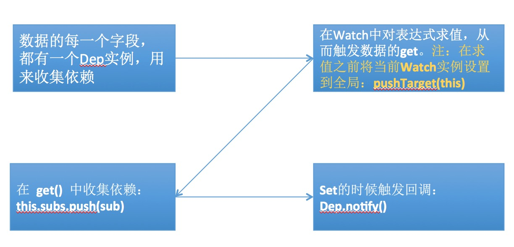
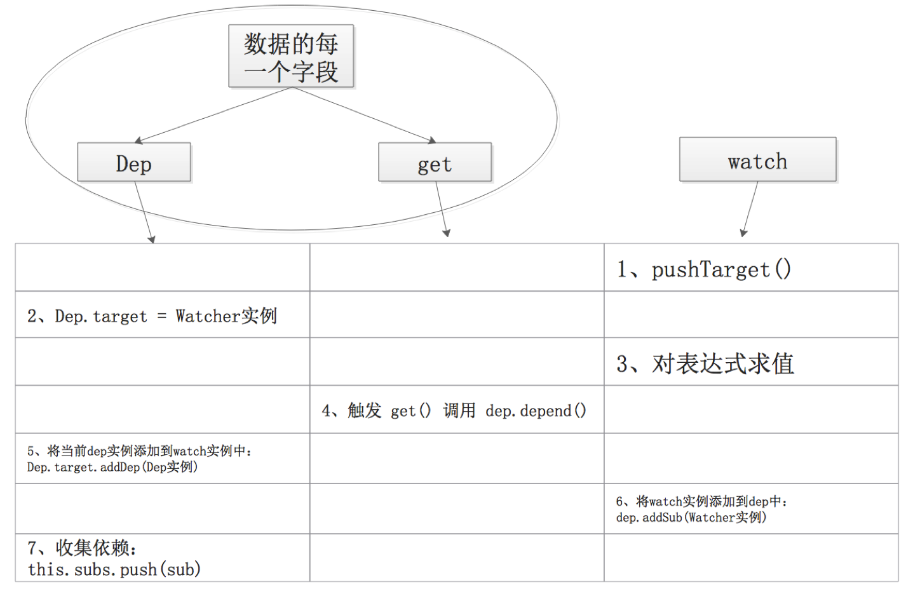

## Vue的数据响应系统

>Vue的数据响应系统包含三个部分：Observer、Dep、Watcher。关于数据响应系统的内容真的已经被文章讲烂了，所以我就简单的说一下，力求大家能理解就ok，我们还是先看一下 initData 中的代码：

	function initData (vm: Component) {
	  let data = vm.$options.data
	  data = vm._data = typeof data === 'function'
	    ? data.call(vm)
	    : data || {}
	  if (!isPlainObject(data)) {
	    data = {}
	    process.env.NODE_ENV !== 'production' && warn(
	      'data functions should return an object:\n' +
	      'https://vuejs.org/v2/guide/components.html#data-Must-Be-a-Function',
	      vm
	    )
	  }
	  // proxy data on instance
	  const keys = Object.keys(data)
	  const props = vm.$options.props
	  let i = keys.length
	  while (i--) {
	    if (props && hasOwn(props, keys[i])) {
	      process.env.NODE_ENV !== 'production' && warn(
	        `The data property "${keys[i]}" is already declared as a prop. ` +
	        `Use prop default value instead.`,
	        vm
	      )
	    } else {
	      proxy(vm, keys[i])
	    }
	  }
	  // observe data
	  observe(data)
	  data.__ob__ && data.__ob__.vmCount++
	}
>首先，先拿到 data 数据：let data = vm.$options.data，大家还记得此时 vm.$options.data 的值应该是通过 mergeOptions 合并处理后的 mergedInstanceDataFn 函数吗？所以在得到 data 后，它又判断了 data 的数据类型是不是 ‘function’，最终的结果是：data 还是我们传入的数据选项的 data，即：

	data: {
		a: 1,
		b: [1, 2, 3]
	}
>然后在实例对象上定义 _data 属性，该属性与 data 是相同的引用。

>然后是一个 while 循环，循环的目的是在实例对象上对数据进行代理，这样我们就能通过 this.a 来访问 data.a 了，代码的处理是在 proxy 函数中，该函数非常简单，仅仅是在实例对象上设置与 data属性同名的访问器属性，然后使用 _data 做数据劫持，如下：

	function proxy (vm: Component, key: string) {
	  if (!isReserved(key)) {
	    Object.defineProperty(vm, key, {
	      configurable: true,
	      enumerable: true,
	      get: function proxyGetter () {
	        return vm._data[key]
	      },
	      set: function proxySetter (val) {
	        vm._data[key] = val
	      }
	    })
	  }
	}
>做完数据的代理，就正式进入响应系统，

	observe(data)
>我们说过，数据响应系统主要包含三部分：Observer、Dep、Watcher，代码分别存放在：observer/index.js、observer/dep.js 以及 observer/watcher.js 文件中，这回我们换一种方式，我们先不看其源码，大家先跟着我的思路来思考，最后回头再去看代码，你会有一种：”奥，不过如此“的感觉。

>假如，我们有如下代码：

	var data = {
	    a: 1,
	    b: {
	        c: 2
	    }
	}

	observer(data)
	
	new Watch('a', () => {
	    alert(9)
	})
	new Watch('a', () => {
	    alert(90)
	})
	new Watch('b.c', () => {
	    alert(80)
	})
>这段代码目的是，首先定义一个数据对象 data，然后通过 observer 对其进行观测，之后定义了三个观察者，当数据有变化时，执行相应的方法，这个功能使用Vue的实现原来要如何去实现？其实就是在问 observer 怎么写？Watch 构造函数又怎么写？接下来我们逐一实现。

	class Observer {
	    constructor (data) {
	        this.walk(data)
	    }
	    walk (data) {
	        // 遍历 data 对象属性，调用 defineReactive 方法
	        let keys = Object.keys(data)
	        for(let i = 0; i < keys.length; i++){
	            defineReactive(data, keys[i], data[keys[i]])
	        }
	    }
	}

>// defineReactive方法仅仅将data的属性转换为访问器属性

	function defineReactive (data, key, val) {
		// 递归观测子属性
	    observer(val)
	
	    Object.defineProperty(data, key, {
	        enumerable: true,
	        configurable: true,
	        get: function () {
	            return val
	        },
	        set: function (newVal) {
	            if(val === newVal){
	                return
	            }
	            // 对新值进行观测
	            observer(newVal)
	        }
	    })
	}

>// observer 方法首先判断data是不是纯JavaScript对象，如果是，调用 Observer 类进行观测

	function observer (data) {
	    if(Object.prototype.toString.call(data) !== '[object Object]') {
	        return
	    }
	    new Observer(data)
	}

>上面的代码中，我们定义了 observer 方法，该方法检测了数据data是不是纯JavaScript对象，如果是就调用 Observer 类，并将 data 作为参数透传。在 Observer 类中，我们使用 walk 方法对数据data的属性循环调用 defineReactive 方法，defineReactive 方法很简单，仅仅是将数据data的属性转为访问器属性，并对数据进行递归观测，否则只能观测数据data的直属子属性。这样我们的第一步工作就完成了，当我们修改或者获取data属性值的时候，通过 get 和 set 即能获取到通知。

>我们继续往下看，来看一下 Watch：

	new Watch('a', () => {
	    alert(9)
	})

>现在的问题是，Watch 要怎么和 observer 关联？？？？？？？我们看看 Watch 它知道些什么，通过上面调用 Watch 的方式，传递给 Watch 两个参数，一个是 ‘a’ 我们可以称其为表达式，另外一个是回调函数。所以我们目前只能写出这样的代码：

	class Watch {
	    constructor (exp, fn) {
	        this.exp = exp
	        this.fn = fn
	    }
	}
那么要怎么关联呢，大家看下面的代码会发生什么：

	class Watch {
	    constructor (exp, fn) {
	        this.exp = exp
	        this.fn = fn
	        data[exp]
	    }
	}

>多了一句 data[exp]，这句话是在干什么？是不是在获取 data 下某个属性的值，比如 exp 为 ‘a’ 的话，那么 data[exp] 就相当于在获取 data.a 的值，那这会放生什么？大家不要忘了，此时数据 data 下的属性已经是访问器属性了，所以这么做的结果会直接触发对应属性的 get 函数，这样我们就成功的和 observer 产生了关联，但这样还不够，我们还是没有达到目的，不过我们已经无限接近了，我们继续思考看一下可不可以这样：

>既然在 Watch 中对表达式求值，能够触发 observer 的 get，那么可不可以在 get 中收集 Watch 中函数呢？

>答案是可以的，不过这个时候我们就需要 Dep 出场了，它是一个依赖收集器。我们的思路是：data 下的每一个属性都有一个唯一的 Dep 对象，在 get 中收集仅针对该属性的依赖，然后在 set 方法中触发所有收集的依赖，这样就搞定了，看如下代码：

	class Dep {
	    constructor () {
	        this.subs = []
	    }
	    addSub () {
	        this.subs.push(Dep.target)
	    }
	    notify () {
	        for(let i = 0; i < this.subs.length; i++){
	            this.subs[i].fn()
	        }
	    }
	}
	Dep.target = null
	function pushTarget(watch){
	    Dep.target = watch
	}
	
	class Watch {
	    constructor (exp, fn) {
	        this.exp = exp
	        this.fn = fn
	        pushTarget(this)
	        data[exp]
	    }
	}

>上面的代码中，我们在 Watch 中增加了 pushTarget(this)，可以发现，这句代码的作用是将 Dep.target 的值设置为该Watch对象。在 pushTarget 之后我们才对表达式进行求值，接着，我们修改 defineReactive 代码如下

	function defineReactive (data, key, val) {
	    observer(val)
	    let dep = new Dep()		// 新增
	    Object.defineProperty(data, key, {
	        enumerable: true,
	        configurable: true,
	        get: function () {
	            dep.addSub()	// 新增
	            return val
	        },
	        set: function (newVal) {
	            if(val === newVal){
	                return
	            }
	            observer(newVal)
	            dep.notify()	// 新增
	        }
	    })
	}

>如标注，新增了三句代码，我们知道，Watch 中对表达式求值会触发 get 方法，我们在 get 方法中调用了 dep.addSub，也就执行了这句代码：this.subs.push(Dep.target)，由于在这句代码执行之前，Dep.target 的值已经被设置为一个 Watch 对象了，所以最终结果就是收集了一个 Watch 对象，然后在 set 方法中我们调用了 dep.notify，所以当data属性值变化的时候，就会通过 dep.notify 循环调用所有收集的Watch对象中的回调函数：

	notify () {
	    for(let i = 0; i < this.subs.length; i++){
	        this.subs[i].fn()
	    }
	}

>这样 observer、Dep、Watch 三者就联系成为一个有机的整体，实现了我们最初的目标，完整的代码可以戳这里：observer-dep-watch。这里还给大家挖了个坑，因为我们没有处理对数组的观测，由于比较复杂并且这又不是我们讨论的重点，如果大家想了解可以戳我的这篇文章：JavaScript实现MVVM之我就是想监测一个普通对象的变化，另外，在 Watch 中对表达式求值的时候也只做了直接子属性的求值，所以如果 exp 的值为 ‘a.b’ 的时候，就不可以用了，Vue的做法是使用 . 分割表达式字符串为数组，然后遍历一下对其进行求值，大家可以查看其源码。如下：

	/**
	 * Parse simple path.
	 */
	const bailRE = /[^\w.$]/
	export function parsePath (path: string): any {
	  if (bailRE.test(path)) {
	    return
	  } else {
	    const segments = path.split('.')
	    return function (obj) {
	      for (let i = 0; i < segments.length; i++) {
	        if (!obj) return
	        obj = obj[segments[i]]
	      }
	      return obj
	    }
	  }
	}

>Vue 的求值代码是在 src/core/util/lang.js 文件中 parsePath 函数中实现的。总结一下Vue的依赖收集过程应该是这样的：

>实际上，Vue并没有直接在 get 中调用 addSub，而是调用的 dep.depend，目的是将当前的 dep 对象收集到 watch 对象中，如果要完整的流程，应该是这样的：（大家注意数据的每一个字段都拥有自己的 dep 对象和 get 方法。）

>这样 Vue 就建立了一套数据响应系统，之前我们说过，按照我们的例子那样写，初始化工作只包含两个主要内容即：initData 和 initRender。现在 initData 我们分析完了，接下来看一看 initRender