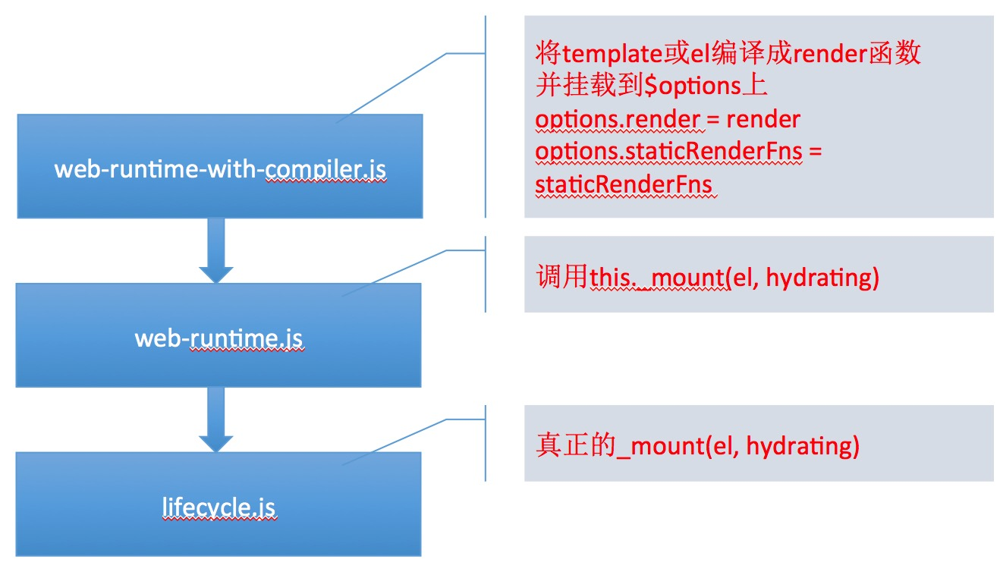
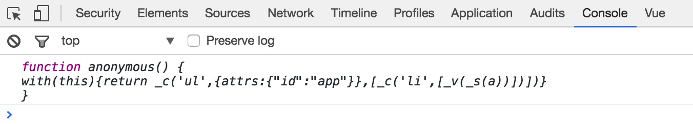
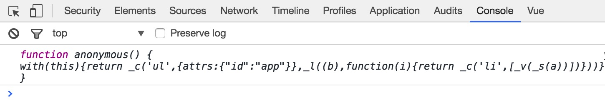

## Vue的渲染

>在 initRender 方法中，因为我们的例子中传递了 el 选项，所以下面的代码会执行：

	if (vm.$options.el) {
	  vm.$mount(vm.$options.el)
	}

>这里，调用了 $mount 方法，在还原Vue构造函数的时候，我们整理过所有的方法，其中 $mount 方法在两个地方出现过：

>1、在 web-runtime.js 文件中：

	Vue.prototype.$mount = function (
	  el?: string | Element,
	  hydrating?: boolean
	): Component {
	  el = el && inBrowser ? query(el) : undefined
	  return this._mount(el, hydrating)
	}

>它的作用是通过 el 获取相应的DOM元素，然后调用 lifecycle.js 文件中的 _mount 方法。

>2、在 web-runtime-with-compiler.js 文件中：

	// 缓存了来自 web-runtime.js 的 $mount 方法
	const mount = Vue.prototype.$mount
	// 重写 $mount 方法
	Vue.prototype.$mount = function (
	  el?: string | Element,
	  hydrating?: boolean
	): Component {
	  // 根据 el 获取相应的DOM元素
	  el = el && query(el)
	  // 不允许你将 el 挂载到 html 标签或者 body 标签
	  if (el === document.body || el === document.documentElement) {
	    process.env.NODE_ENV !== 'production' && warn(
	      `Do not mount Vue to <html> or <body> - mount to normal elements instead.`
	    )
	    return this
	  }
	
	  const options = this.$options
	  // 如果我们没有写 render 选项，那么就尝试将 template 或者 el 转化为 render 函数
	  if (!options.render) {
	    let template = options.template
	    if (template) {
	      if (typeof template === 'string') {
	        if (template.charAt(0) === '#') {
	          template = idToTemplate(template)
	          /* istanbul ignore if */
	          if (process.env.NODE_ENV !== 'production' && !template) {
	            warn(
	              `Template element not found or is empty: ${options.template}`,
	              this
	            )
	          }
	        }
	      } else if (template.nodeType) {
	        template = template.innerHTML
	      } else {
	        if (process.env.NODE_ENV !== 'production') {
	          warn('invalid template option:' + template, this)
	        }
	        return this
	      }
	    } else if (el) {
	      template = getOuterHTML(el)
	    }
	    if (template) {
	      const { render, staticRenderFns } = compileToFunctions(template, {
	        warn,
	        shouldDecodeNewlines,
	        delimiters: options.delimiters
	      }, this)
	      options.render = render
	      options.staticRenderFns = staticRenderFns
	    }
	  }
	  // 调用已经缓存下来的 web-runtime.js 文件中的 $mount 方法
	  return mount.call(this, el, hydrating)
	}

>分析一下可知 web-runtime-with-compiler.js 的逻辑如下：

>1、缓存来自 web-runtime.js 文件的 $mount 方法

>2、判断有没有传递 render 选项，如果有直接调用来自 web-runtime.js 文件的 $mount 方法

>3、如果没有传递 render 选项，那么查看有没有 template 选项，如果有就使用 compileToFunctions 函数根据其内容编译成 render 函数

>4、如果没有 template 选项，那么查看有没有 el 选项，如果有就使用 compileToFunctions 函数将其内容(template = getOuterHTML(el))编译成 render 函数

>5、将编译成的 render 函数挂载到 this.$options 属性下，并调用缓存下来的 web-runtime.js 文件中的 $mount 方法

>简单的用一张图表示 mount 方法的调用关系，从上至下调用：

>不过不管怎样，我们发现这些步骤的最终目的是生成 render 函数，然后再调用 lifecycle.js 文件中的 _mount 方法，我们看看这个方法做了什么事情，查看 _mount 方法的代码，这是简化过得：

	Vue.prototype._mount = function (
	  el?: Element | void,
	  hydrating?: boolean
	): Component {
	  const vm: Component = this
	
	  // 在Vue实例对象上添加 $el 属性，指向挂载点元素
	  vm.$el = el
	
	  // 触发 beforeMount 生命周期钩子
	  callHook(vm, 'beforeMount')
	
	  vm._watcher = new Watcher(vm, () => {
	    vm._update(vm._render(), hydrating)
	  }, noop)
	
	  // 如果是第一次mount则触发 mounted 生命周期钩子
	  if (vm.$vnode == null) {
	    vm._isMounted = true
	    callHook(vm, 'mounted')
	  }
	  return vm
	}

>上面的代码很简单，该注释的都注释了，唯一需要看的就是这段代码：

	vm._watcher = new Watcher(vm, () => {
	  vm._update(vm._render(), hydrating)
	}, noop)

>看上去很眼熟有没有？我们平时使用Vue都是这样使用 watch的：

	this.$watch('a', (newVal, oldVal) => {
		
	})
	// 或者
	this.$watch(function(){
		return this.a + this.b
	}, (newVal, oldVal) => {
		
	})

>第一个参数是 表达式或者函数，第二个参数是回调函数，第三个参数是可选的选项。原理是 Watch 内部对表达式求值或者对函数求值从而触发数据的 get 方法收集依赖。可是 _mount 方法中使用 Watcher的时候第一个参数 vm 是什么鬼。我们不妨去看看源码中 $watch 函数是如何实现的，根据之前还原Vue构造函数中所整理的内容可知：$warch 方法是在 src/core/instance/state.js 文件中的 stateMixin 方法中定义的，源码如下：

	Vue.prototype.$watch = function (
	  expOrFn: string | Function,
	  cb: Function,
	  options?: Object
	): Function {
	  const vm: Component = this
	  options = options || {}
	  options.user = true
	  const watcher = new Watcher(vm, expOrFn, cb, options)
	  if (options.immediate) {
	    cb.call(vm, watcher.value)
	  }
	  return function unwatchFn () {
	    watcher.teardown()
	  }
	}

>我们可以发现，$warch 其实是对 Watcher 的一个封装，内部的 Watcher 的第一个参数实际上也是 vm 即：Vue实例对象，这一点我们可以在 Watcher 的源码中得到验证，代开 observer/watcher.js 文件查看：

	export default class Watcher {
	
	  constructor (
	    vm: Component,
	    expOrFn: string | Function,
	    cb: Function,
	    options?: Object = {}
	  ) {
	    
	  }
	}

>可以发现真正的 Watcher 第一个参数实际上就是 vm。第二个参数是表达式或者函数，然后以此类推，所以现在再来看 _mount 中的这段代码：

	vm._watcher = new Watcher(vm, () => {
	  vm._update(vm._render(), hydrating)
	}, noop)

>忽略第一个参数 vm，也就说，Watcher 内部应该对第二个参数求值，也就是运行这个函数：

	() => {
	  vm._update(vm._render(), hydrating)
	}

>所以 vm._render() 函数被第一个执行，该函数在 src/core/instance/render.js 中，该方法中的代码很多，下面是简化过的：

	Vue.prototype._render = function (): VNode {
	  const vm: Component = this
	  // 解构出 $options 中的 render 函数
	  const {
	    render,
	    staticRenderFns,
	    _parentVnode
	  } = vm.$options
	  ...
	
	  let vnode
	  try {
	    // 运行 render 函数
	    vnode = render.call(vm._renderProxy, vm.$createElement)
	  } catch (e) {
	    ...
	  }
	  
	  // set parent
	  vnode.parent = _parentVnode
	  return vnode
	}

>_render 方法首先从 vm.$options 中解构出 render 函数，大家应该记得：vm.$options.render 方法是在 web-runtime-with-compiler.js 文件中通过 compileToFunctions 方法将 template 或 el编译而来的。解构出 render 函数后，接下来便执行了该方法：

>vnode = render.call(vm._renderProxy, vm.$createElement)
其中使用 call 指定了 render 函数的作用域环境为 vm._renderProxy，这个属性在我们整理实例对象的时候知道，他是在 Vue.prototype._init 方法中被添加的，即：vm._renderProxy = vm，其实就是Vue实例对象本身，然后传递了一个参数：vm.$createElement。那么 render 函数到底是干什么的呢？让我们根据上面那句代码猜一猜，我们已经知道 render 函数是从 template 或 el 编译而来的，如果没错的话应该是返回一个虚拟DOM对象。我们不妨使用 console.log 打印一下 render 函数，当我们的模板这样编写时：

	<ul id="app">
	  <li>{{a}}</li>
	</ul>
>打印的 render 函数如下：

我们修改模板为：

	<ul id="app">
	  <li v-for="i in b">{{a}}</li>
	</ul>
打印出来的 render 函数如下：

>其实了解Vue2.x版本的同学都知道，Vue提供了 render 选项，作为 template 的代替方案，同时为JavaScript提供了完全编程的能力，下面两种编写模板的方式实际是等价的：

	// 方案一：
	new Vue({
		el: '#app',
		data: {
			a: 1
		},
		template: '<ul><li>{{a}}</li><li>{{a}}</li></ul>'
	})
	
	// 方案二：
	new Vue({
		el: '#app',
		render: function (createElement) {
			createElement('ul', [
				createElement('li', this.a),
				createElement('li', this.a)
			])
		}
	})
>现在我们再来看我们打印的 render 函数：

	function anonymous() {
		with(this){
			return _c('ul', { 
				attrs: {"id": "app"}
			},[
				_c('li', [_v(_s(a))])
			])
		}
	}

>是不是与我们自己写 render 函数很像？因为 render 函数的作用域被绑定到了Vue实例，即：render.call(vm._renderProxy, vm.$createElement)，所以上面代码中 _c、_v、_s 以及变量 a相当于Vue实例下的方法和变量。大家还记得诸如 _c、_v、_s 这样的方法在哪里定义的吗？我们在整理Vue构造函数的时候知道，他们在 src/core/instance/render.js 文件中的 renderMixin 方法中定义，除了这些之外还有诸如：_l、 _m、 _o 等等。其中 _l 就在我们使用 v-for 指令的时候出现了。所以现在大家知道为什么这些方法都被定义在 render.js 文件中了吧，因为他们就是为了构造出 render函数而存在的。

>现在我们已经知道了 render 函数的长相，也知道了 render 函数的作用域是Vue实例本身即：this(或vm)。那么当我们执行 render 函数时，其中的变量如：a，就相当于：this.a，我们知道这是在求值，所以 _mount 中的这段代码：

	vm._watcher = new Watcher(vm, () => {
	  vm._update(vm._render(), hydrating)
	}, noop)
>当 vm._render 执行的时候，所依赖的变量就会被求值，并被收集为依赖。按照Vue中 watcher.js 的逻辑，当依赖的变量有变化时不仅仅回调函数被执行，实际上还要重新求值，即还要执行一遍：

	() => {
	  vm._update(vm._render(), hydrating)
	}
>这实际上就做到了 re-render，因为 vm._update 就是文章开头所说的虚拟DOM中的最后一步：patch

>vm_render 方法最终返回一个 vnode 对象，即虚拟DOM，然后作为 vm_update 的第一个参数传递了过去，我们看一下 vm_update 的逻辑，在 src/core/instance/lifecycle.js 文件中有这么一段代码：

	if (!prevVnode) {
	  // initial render
	  vm.$el = vm.__patch__(
	    vm.$el, vnode, hydrating, false /* removeOnly */,
	    vm.$options._parentElm,
	    vm.$options._refElm
	  )
	} else {
	  // updates
	  vm.$el = vm.__patch__(prevVnode, vnode)
	}
>如果还没有 prevVnode 说明是首次渲染，直接创建真实DOM。如果已经有了 prevVnode 说明不是首次渲染，那么就采用 patch 算法进行必要的DOM操作。这就是Vue更新DOM的逻辑。只不过我们没有将 virtual DOM 内部的实现。

>现在我们来好好理理思路，当我们写如下代码时：

	new Vue({
		el: '#app',
		data: {
			a: 1,
			b: [1, 2, 3]
		}
	})

>Vue 所做的事：

>1、构建数据响应系统，使用 Observer 将数据data转换为访问器属性；将 el 编译为 render 函数，render 函数返回值为虚拟DOM

>2、在 _mount 中对 _update 求值，而 _update 又会对 render 求值，render 内部又会对依赖的变量求值，收集为被求值的变量的依赖，当变量改变时，_update 又会重新执行一遍，从而做到 re-render。

>用一张详细一点的图表示就是这样的：

>到此，我们从大体流程，挑着重点的走了一遍Vue，但是还有很多细节我们没有提及，比如：

>1、将模板转为 render 函数的时候，实际是先生成的抽象语法树（AST），再将抽象语法树转成的 render 函数，而且这一整套的代码我们也没有提及，因为他在复杂了，其实这部分内容就是在完正则。

>2、我们也没有详细的讲 Virtual DOM 的实现原理，网上已经有文章讲了，大家可以搜一搜

>3、我们的例子中仅仅传递了 el ，data 选项，大家知道 Vue 支持的选项很多，比如我们都没有讲到，但都是触类旁通的，比如你搞清楚了 data 选项再去看 computed 选项或者 props 选项就会很容易，比如你知道了 Watcher 的工作机制再去看 watch 选项就会很容易。